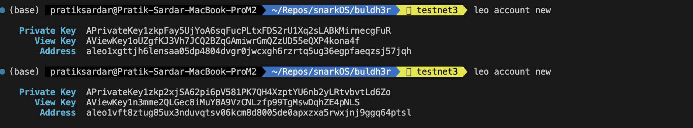
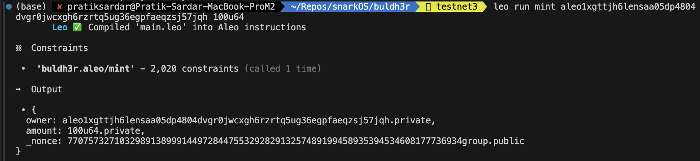
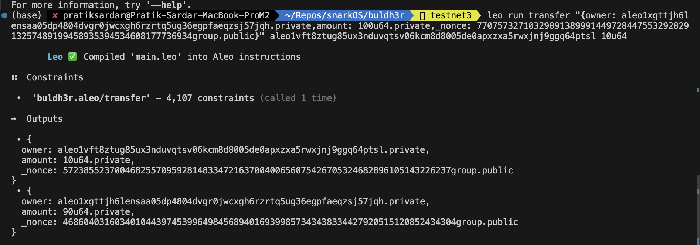

# buldh3r.aleo

 1. leo account new #to create new account
 2. `leo run mint <address> amount`
 3. update the private keys in .env file to sign transaction
 4. `leo run transfer <output of mint> <reciever address> <transfer amount> `


## Build Guide

To compile this Aleo program, run:
```bash
snarkvm build
```

To execute this Aleo program, run:
```bash
snarkvm run hello
```
#sample output images


